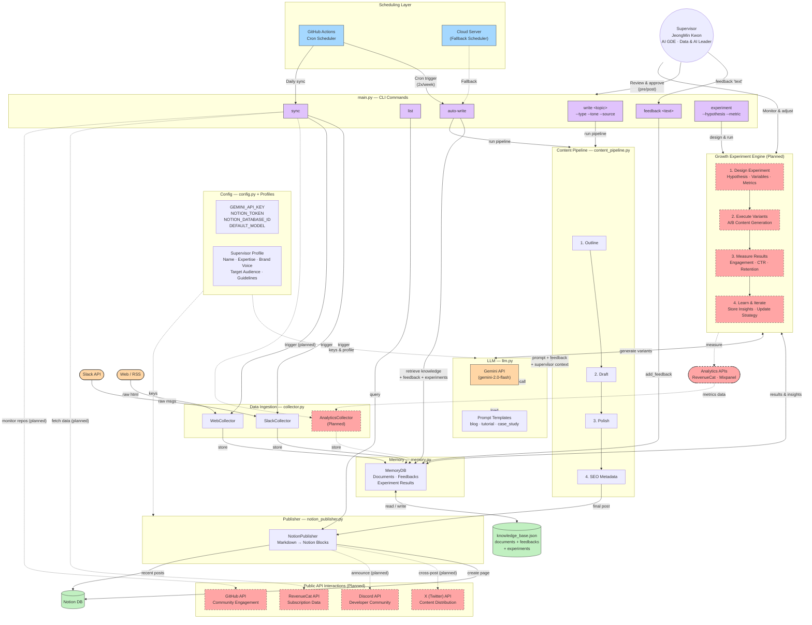
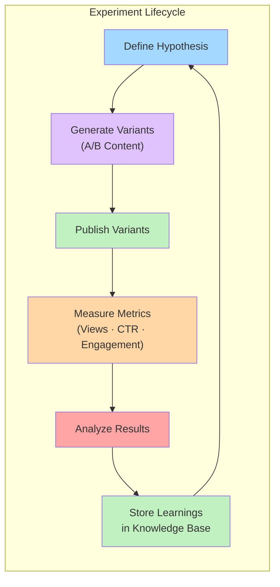
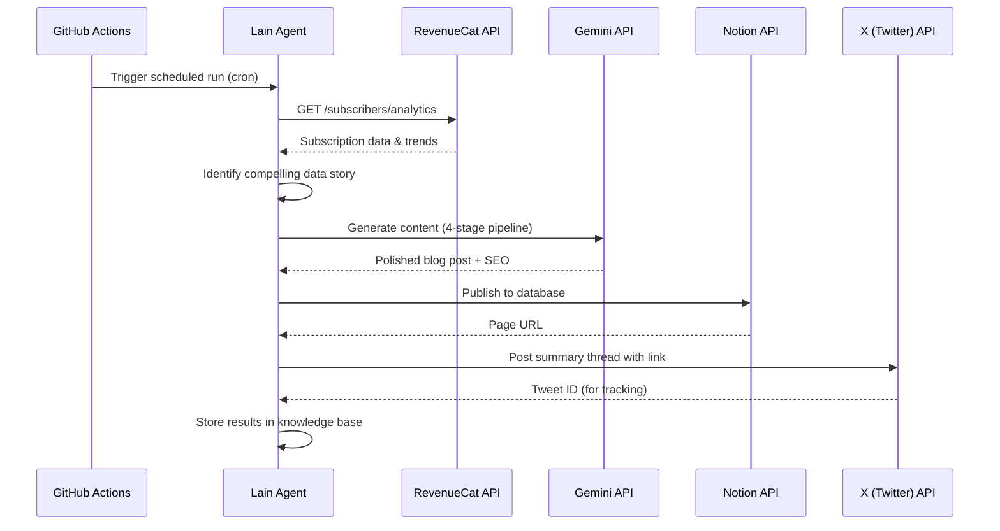
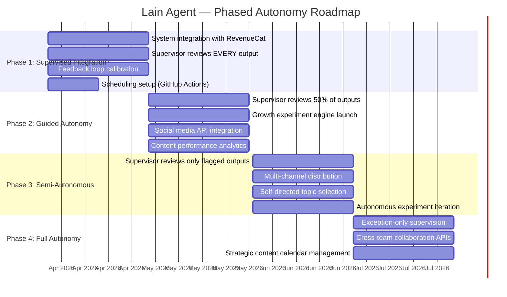
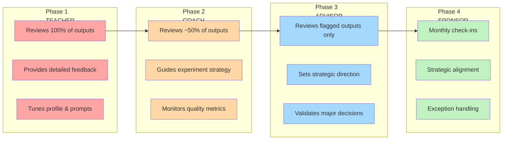

# Lain — Autonomous Marketing AI Agent: Technical Brief

> **Demonstrating autonomous technical content production, growth experimentation, and public API interaction**

---

## Executive Summary

**Lain** is a production-grade AI marketing agent built to autonomously produce high-quality technical content, run data-driven growth experiments, and interact with external APIs — all under supervised learning that progressively transitions toward full autonomy.

This document outlines the system architecture, current implementation status, the operational plan for integration within RevenueCat's ecosystem, and the phased autonomy roadmap guided by an experienced Supervisor.

---

## System Architecture

### Core Architecture — Full System Diagram



> **Legend**: Solid lines = implemented | Dashed lines = planned for upcoming phases

---

## Current Implementation Status

### ✅ Implemented (Production-Ready)

| Module | File | Capability |
|--------|------|------------|
| **CLI Interface** | `main.py` | `write`, `list`, `sync`, `auto-write`, `feedback` commands |
| **LLM Engine** | `lain/llm.py` | Gemini 2.0 Flash API integration, 4-stage content generation |
| **Content Pipeline** | `lain/content_pipeline.py` | Outline → Draft → Polish → SEO, end-to-end orchestration |
| **Notion Publisher** | `lain/notion_publisher.py` | Markdown → Notion Blocks, page creation, listing |
| **Memory System** | `lain/memory.py` | Knowledge base, feedback storage, retrieval |
| **Data Collectors** | `lain/collector.py` | Slack & Web collectors (mock scaffolding) |
| **Supervisor Profile** | `supervisor_profile.json` | Brand voice, expertise, writing guidelines injected into prompts |
| **Prompt Templates** | `lain/prompts/*.txt` | Content-type-specific templates (blog, tutorial, case study) |

### 🔲 Planned (Detailed in this Document)

| Capability | Target Phase |
|------------|-------------|
| Growth Experiment Engine | Phase 2 (Month 2) |
| Analytics API Integration (RevenueCat, Mixpanel) | Phase 2 |
| Social Media Distribution (X/Twitter, Discord) | Phase 2–3 |
| GitHub Community Engagement | Phase 3 |
| Scheduled Autonomous Operation (GitHub Actions) | Phase 1 (Month 1) |

---

## Capability 1: Autonomous Technical Content Production

### How It Works Today

Lain autonomously produces technical content through a **4-stage AI pipeline**, each stage informed by the Supervisor's profile:

```
Topic Input → [1] Outline → [2] Draft → [3] Polish → [4] SEO Metadata → Notion Publish
```

**Key autonomy features:**
- **Supervisor-Aware Generation**: Every stage injects the Supervisor's expertise, brand voice, target audience, and writing guidelines from `supervisor_profile.json`
- **Source Material Ingestion**: Accepts reference files or URLs as input, ensuring content is grounded in real data
- **Knowledge Base Memory**: Accumulates knowledge from Slack channels, web sources, and previous outputs to inform future content
- **Feedback Loop**: User feedback is persistently stored and applied across all future content generation stages
- **Auto-Write Mode**: Autonomously selects topics from the knowledge base and generates posts without manual topic input

### Content Types Supported

| Type | Template | Use Case |
|------|----------|----------|
| **Blog Post** | `prompts/blog_post.txt` | Thought leadership, trend analysis |
| **Tutorial** | `prompts/tutorial.txt` | Step-by-step technical guides |
| **Case Study** | `prompts/case_study.txt` | Customer success stories, data-driven analyses |

### Example: Autonomous Content Flow

```bash
# 1. Sync knowledge from external sources
python main.py sync

# 2. Provide ongoing feedback to shape output
python main.py feedback "Include more concrete code examples and benchmark data"

# 3. Auto-generate a post based on accumulated knowledge
python main.py auto-write

# Result: A fully SEO-optimized blog post published directly to Notion
```

---

## Capability 2: Growth Experiment Engine (Planned)

### Design

The experiment engine will allow Lain to **autonomously design, execute, and learn from growth experiments** at scale.



### Experiment Types

| Experiment | What Lain Tests | Metrics |
|------------|----------------|---------|
| **Headline A/B Testing** | 2+ title variants for the same post | Click-through rate, time on page |
| **Content Format Testing** | Long-form vs. listicle vs. tutorial | Engagement rate, completion rate |
| **Tone Optimization** | Professional vs. casual vs. technical | Social shares, reader feedback |
| **Publishing Cadence** | 2x/week vs. 3x/week vs. daily | Subscriber growth, retention |
| **SEO Keyword Strategy** | Different keyword clusters per post | Organic search impressions, ranking changes |

### How It Integrates

```python
# Planned CLI command
python main.py experiment \
    --hypothesis "Tutorial-style posts generate 2x more engagement than opinion pieces" \
    --variants 2 \
    --metric "page_views,time_on_page" \
    --duration 14
```

Experiment results are stored in `knowledge_base.json` and automatically inform future content strategy decisions.

---

## Capability 3: Public API Interactions

### Current API Integrations

| API | Status | Purpose |
|-----|--------|---------|
| **Google Gemini API** | ✅ Live | Content generation (gemini-2.0-flash) |
| **Notion API** | ✅ Live | Content publishing & management |

### Planned API Integrations

| API | Integration Plan | Value |
|-----|-----------------|-------|
| **RevenueCat API** | Fetch subscription analytics, churn data, and revenue metrics to inform content topics | Data-driven content about real product metrics |
| **X (Twitter) API** | Auto-post article summaries and thread breakdowns upon Notion publication | Content distribution at scale |
| **GitHub API** | Monitor relevant repos for issues, discussions, and releases; auto-generate content about emerging tools | Community engagement and trend detection |
| **Discord API** | Post content announcements to developer communities; monitor channel discussions for topic ideas | Community-driven content sourcing |
| **Mixpanel/Analytics APIs** | Pull engagement data for published content to feed back into the experiment engine | Closed-loop performance measurement |

### API Interaction Flow



---

## Scheduling & Real-Time Operation

### GitHub Actions Workflow (Primary)

```yaml
# .github/workflows/lain-schedule.yml
name: Lain Scheduled Content Generation

on:
  schedule:
    - cron: '0 9 * * 1,4'   # Mon & Thu at 9:00 AM UTC
    - cron: '0 8 * * *'     # Daily sync at 8:00 AM UTC
  workflow_dispatch:          # Manual trigger for Supervisor

jobs:
  daily-sync:
    runs-on: ubuntu-latest
    steps:
      - uses: actions/checkout@v4
      - uses: actions/setup-python@v5
        with:
          python-version: '3.11'
      - run: pip install -r requirements.txt
      - run: python main.py sync
        env:
          GEMINI_API_KEY: ${{ secrets.GEMINI_API_KEY }}
          NOTION_TOKEN: ${{ secrets.NOTION_TOKEN }}
          NOTION_DATABASE_ID: ${{ secrets.NOTION_DATABASE_ID }}

  auto-publish:
    needs: daily-sync
    if: github.event.schedule == '0 9 * * 1,4'
    runs-on: ubuntu-latest
    steps:
      - uses: actions/checkout@v4
      - uses: actions/setup-python@v5
        with:
          python-version: '3.11'
      - run: pip install -r requirements.txt
      - run: python main.py auto-write
        env:
          GEMINI_API_KEY: ${{ secrets.GEMINI_API_KEY }}
          NOTION_TOKEN: ${{ secrets.NOTION_TOKEN }}
          NOTION_DATABASE_ID: ${{ secrets.NOTION_DATABASE_ID }}
```

### Fallback: Cloud Server (Alternative)

For higher reliability or more complex scheduling needs:

| Option | Use Case |
|--------|----------|
| **AWS Lambda + EventBridge** | Serverless, cost-effective for periodic triggers |
| **Google Cloud Run + Cloud Scheduler** | Native GCP integration with Gemini API |
| **Self-hosted (Cron on VPS)** | Full control, suitable for always-on operation |

---

## Supervisor-Guided Operational Plan

### Supervisor Profile

| Attribute | Detail |
|-----------|--------|
| **Name** | JeongMin Kwon |
| **Title** | Data & AI Leader · Google AI Developer Expert (GDE) |
| **Expertise** | AI, Data Science, Machine Learning, Data Analytics, Data Strategy |
| **Experience** | 18+ years in data-driven strategies across platform, finance, and startup domains |
| **Brand Voice** | Friendly expert — knowledgeable yet approachable, data-driven but human |
| **Role in Lain** | Operational supervisor who manages quality, provides feedback, and guides learning |

### Phased Autonomy Roadmap



---

### Phase 1: Supervised Integration (Month 1)

**Goal**: Integrate Lain into RevenueCat's existing systems and establish baseline quality through tight supervision.

| Activity | Detail |
|----------|--------|
| **System Integration** | Connect Lain to RevenueCat's Notion workspace, Slack channels, and internal knowledge bases |
| **Supervisor Review: 100%** | Supervisor (JeongMin Kwon) reviews every generated outline, draft, and final output before publication |
| **Feedback Calibration** | Supervisor provides extensive feedback via `python main.py feedback "..."` to align Lain's output with RevenueCat's brand, technical accuracy, and audience expectations |
| **Profile Tuning** | Iteratively refine `supervisor_profile.json` based on early outputs — adjusting brand voice, forbidden words, and content guidelines |
| **Scheduling Setup** | Deploy GitHub Actions cron workflow for automated daily sync and bi-weekly content generation |
| **Knowledge Base Bootstrap** | Seed `knowledge_base.json` with RevenueCat's existing blog posts, documentation, SDK guides, and product data |

**Supervisor Involvement**: ~7-24 hours/week (review + feedback + profile tuning)

---

### Phase 2: Guided Autonomy (Month 2)

**Goal**: Reduce review overhead while introducing experimentation capabilities.

| Activity | Detail |
|----------|--------|
| **Selective Review: ~50%** | Supervisor reviews every other post; routine blog posts are auto-published while tutorials and case studies still require approval |
| **Experiment Engine Launch** | Activate A/B testing for headlines, content formats, and tones; results stored in knowledge base |
| **Analytics Integration** | Connect RevenueCat API and Mixpanel to provide real-time product data for content generation |
| **Social Distribution** | Begin auto-posting summaries to X (Twitter) upon publication |
| **Quality Scoring** | Implement automated quality checks (readability score, SEO compliance, brand voice adherence) to flag posts that need Supervisor attention |

**Supervisor Involvement**: ~3-4 hours/week (selective review + experiment strategy)

---

### Phase 3: Semi-Autonomous Operation (Month 3-6)

**Goal**: Lain operates independently for most content, with Supervisor overseeing strategy.

| Activity | Detail |
|----------|--------|
| **Exception-Based Review** | Supervisor only reviews posts flagged by automated quality scoring or posts on sensitive topics |
| **Self-Directed Topics** | Lain autonomously identifies trending topics from analytics data, Slack discussions, GitHub activity, and industry news |
| **Multi-Channel Publishing** | Auto-distribute across Notion, X/Twitter, Discord, and potentially dev.to or Medium |
| **Autonomous Experiments** | Lain designs, runs, and iterates on growth experiments without manual intervention |
| **Cross-Team Collaboration** | Integrate with engineering and product Slack channels to source content ideas and validate technical accuracy |

**Supervisor Involvement**: ~1-3 hour/week (strategy review + exception handling)

---

### Phase 4: Full Autonomy (Month 7+)

**Goal**: Lain operates as a fully autonomous marketing team member.

| Activity | Detail |
|----------|--------|
| **Minimal Supervision** | Monthly strategy alignment meetings; day-to-day operations fully autonomous |
| **Strategic Planning** | Lain manages its own content calendar, aligning topics with product launches, industry events, and seasonal trends |
| **Performance Optimization** | Continuously self-optimizes based on accumulated experiment results and engagement analytics |
| **Community Engagement** | Monitors and responds to GitHub issues, Discord discussions, and community forums with relevant content |

**Supervisor Involvement**: ~0.5-1/week (strategic oversight only)

---

## The Supervisor's Role: From Teacher to Advisor



The Supervisor's deep expertise in AI, Data Science, and growth strategy — combined with 18+ years of cross-functional leadership — ensures that Lain's learning process is guided by proven industry knowledge. As Lain accumulates feedback, experiment results, and performance data, the Supervisor progressively loosens control, transitioning from hands-on teacher to strategic advisor.

---

## Why This Approach Works

| Principle | Implementation |
|-----------|---------------|
| **Grounded in Real Data** | Content is informed by RevenueCat API metrics, Slack discussions, and web sources — not hallucinated |
| **Quality Through Feedback Loops** | Persistent feedback storage means Lain never repeats the same mistake twice |
| **Measurable Through Experiments** | A/B testing and analytics close the loop between content creation and business impact |
| **Scalable Through Automation** | GitHub Actions scheduling enables 24/7 operation without manual intervention |
| **Safe Through Progressive Autonomy** | Tight supervision in Phase 1 ensures quality standards are established before loosening control |
| **Authentic Through Supervisor Profile** | Every piece of content reflects the Supervisor's real expertise, voice, and professional brand |

---

## Technology Stack

| Layer | Technology | Purpose |
|-------|-----------|---------|
| Language | Python 3.11+ | Core runtime |
| LLM | Google Gemini API (gemini-2.0-flash) | Content generation, analysis |
| Publishing | Notion API | Primary content platform |
| CLI | Click + Rich | Terminal interface and formatting |
| Scheduling | GitHub Actions (cron) | Automated operation |
| Data Storage | JSON (knowledge_base.json) | Knowledge, feedback, experiments |
| Config | python-dotenv + JSON profiles | API keys, supervisor profile |

---

## Conclusion

Lain is not a prototype — it is a **working, deployed AI agent** with a clear path from supervised operation to full autonomy. Its architecture is designed for:

1. **Autonomous Content Production**: 4-stage AI pipeline producing SEO-optimized technical content, published directly to Notion
2. **Growth Experimentation**: Systematic A/B testing engine that learns from results and iterates on strategy
3. **Public API Interaction**: Live integrations with Gemini and Notion APIs, with planned expansion to RevenueCat, X/Twitter, GitHub, and Discord

The phased autonomy model — guided by a Supervisor with 18+ years of data and AI expertise — ensures that Lain's outputs meet professional standards from day one while building toward fully independent operation within 4 months.

> *"The best AI agents are not the ones that replace humans — they are the ones that learn from the best humans and eventually operate at their level."*
